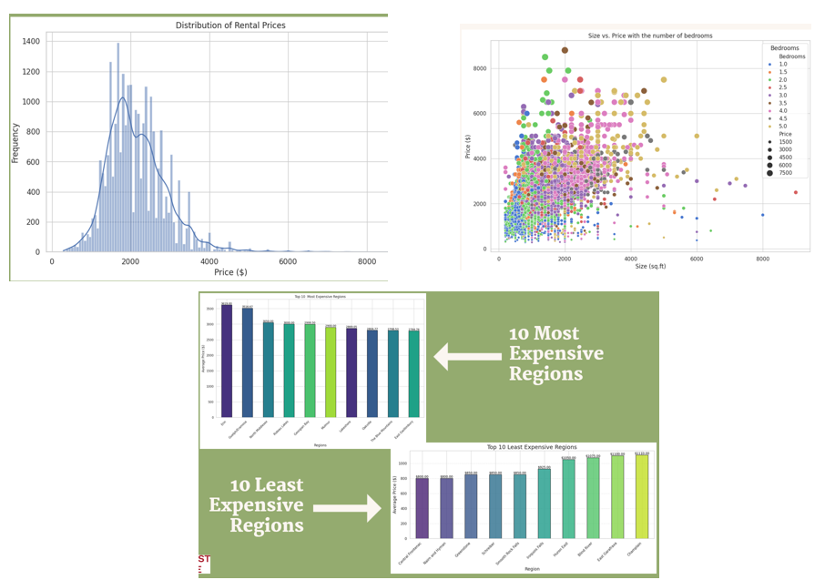

# 👩‍💻 About Me  

Hi there! I'm **Sumithra Balamurugan**, a passionate and driven tech enthusiast currently pursuing a **Diploma in Machine Learning** at NorQuest College. With a solid foundation in **web development, programming, and advanced data analytics**, I thrive on solving problems, building innovative solutions, and continuously expanding my skillset.  

---

## 🛠 Technical Skills:  
- **Programming Languages:** Python, JavaScript, C++  
- **Web Development:** HTML, CSS, WordPress, React, MongoDB  
- **Data Analysis & Visualization:** Excel, Tableau, Power BI  
- **Database Management:** MySQL, Oracle SQL, MongoDB  
- **Cloud Platforms:** AWS, Salesforce  

---

## 🌟 Projects:  

### 1. **Community Data Program**  
**Description:**  
Developed and published an interactive dashboard to analyze and visualize community datasets, showcasing trends and actionable insights. This project was recognized and published by [Stats Canada](https://www.statcan.gc.ca/en/data-science/network/data-decision).  
- **Challenges Solved:**  
  - Cleaned unstructured data and efficiently handled missing values.  
  - Performed feature engineering to enhance data quality and model performance..
  - Developed a machine learning model to predict future rental prices.
  - Built a dynamic, user-friendly dashboard using Looker, which was highly appreciated by clients and instructors.
- **Tech Stack:** Python, Scikit-learn, Excel, Looker  

### Data Visualizations from the Community Data Program

These charts showcase insights derived from rental price analysis:

1. **Distribution of Rental Prices:**  
   The first histogram illustrates the distribution of rental prices across the dataset, highlighting the most common price ranges.

2. **Size vs. Price Correlation:**  
   The scatterplot visualizes the relationship between property size (in square feet) and price, grouped by the number of bedrooms.

3. **Top 10 Most and Least Expensive Regions:**  
   Bar charts highlighting the regions with the highest and lowest average rental prices, giving a clear understanding of regional trends.

**GitHub Repository:** [Community Data Program](https://github.com/sumithactca/Community-data-project)  
[Streamlit App - Predict Housing Prices](https://community-data-project-hwvxcaztzztswrfprgdcq6.streamlit.app/)

---

### 2. **NPRI Dataset Analysis**  
**Description:**  
Analyzed and optimized a large-scale dataset (~500,000 records) from the NPRI (National Pollutant Release Inventory) to extract meaningful insights and enhance processing efficiency.  
- **Key Highlights:**  
  - Reduced dataset size by filtering relevant rows, cutting upload time by 70%.  
  - Applied machine learning models to identify trends in pollution data.  
- **Tech Stack:** Python, Pandas, Scikit-learn  

**Preview:**  
  

**GitHub Repository:** [NPRI Dataset Analysis](https://github.com/sumithactca/Community-data-project)  

---

### 3. **WordPress Projects**  
**Description:**  
Designed and maintained multiple responsive websites for clients, focusing on aesthetics, functionality, and performance.  
- **Achievements:**  
  - Built over 20 custom WordPress sites.  
  - Implemented SEO strategies, increasing site traffic by 30%.  
- **Tech Stack:** WordPress, HTML, CSS  

**Preview:**  
  

**Portfolio:** [My WordPress Work](#)  

---

## 🌱 Current Interests:  
I'm currently diving deeper into **data engineering**, exploring the MERN stack, and enhancing my knowledge in **blockchain development**.  

---

## 📫 Let's Connect:  
- **LinkedIn:** [linkedin.com/in/sumithra-balamurugan](https://linkedin.com/in/sumithra-balamurugan)  
- **Email:** [sumithbala03@gmail.com](mailto:sumithbala03@gmail.com)  

Feel free to explore my repositories to see my work! I'm always open to collaborating on exciting projects and sharing knowledge. 🚀  
